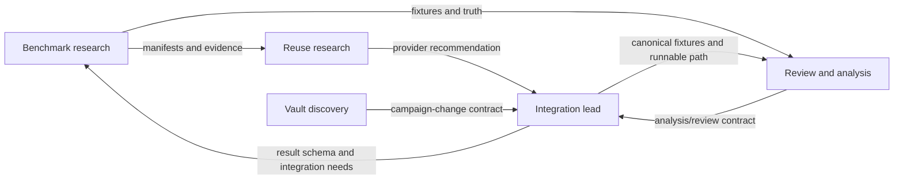

# Project operating model

## Purpose

Four specialist workstreams run in parallel while the integration lead keeps one
continuously runnable product. Repository artifacts, not agent memory or chat, are
the coordination boundary.

## Ownership

| Workstream | Owns | Produces | Does not own |
|---|---|---|---|
| Reuse research | External component evaluation | Scorecards, probes, license notes, recommendations, replacement triggers | Canonical product model |
| Benchmark research | Evaluation corpus and measurement inputs | Manifests, fetch/clip tooling, annotations, result schemas | Selecting a winner without evidence |
| Review and analysis | RPG understanding and attention UX | Analysis contracts, fixtures, ranked review packages, attention metrics | ASR engine internals or vault layout |
| Vault discovery | External-vault understanding and safe export needs | Sanitized structural fixtures, campaign-change contract, safety policy | Modifying the real vault |
| Integration lead | Runnable product and convergence | Canonical boundaries, integrated increments, acceptance decisions, status | Replacing specialist evidence with intuition |

Shared contracts are owned by the integration lead but shaped through specialist
fixtures and findings. A specialist proposing a contract change should document the
consumer need and supply an example; the integration lead makes the cross-cutting
change or explicitly delegates it.

## Dependency flow

Workstreams should use synthetic or sanitized fixtures when an upstream dependency is
not ready. Only the integration lead merges competing changes to shared canonical
contracts.

## Coordination state

- `docs/STATUS.md` records what is true now, active focus, accepted evidence, and
  blockers.
- `docs/BACKLOG.md` is the bootstrap queue until GitHub issues exist.
- `docs/MILESTONES.md` defines outcome gates and sequencing.
- `docs/DECISIONS.md` records accepted architectural/product decisions.
- `docs/RISKS.md` records material delivery, quality, privacy, and safety risks.

GitHub issues become the live execution queue once created. Keep the stable backlog ID
in the issue title or body so repository history remains traceable.

## Issue states and labels

Use the workflow `proposed → ready → in progress → in review → done`, with `blocked`
as an explicit exception. Recommended labels:

- `area:integration`, `area:reuse`, `area:benchmark`, `area:analysis`, `area:vault`
- `type:research`, `type:feature`, `type:contract`, `type:integration`
- `priority:p0`, `priority:p1`, `priority:p2`
- `status:blocked`, `needs:decision`, `needs:evidence`

An item is `ready` only when its output, dependencies, and acceptance evidence are
clear enough for an agent to proceed without product clarification.

## Convergence cadence

Specialists hand off a bounded branch as soon as acceptance evidence exists. The
integration lead:

1. checks the artifact against product boundaries;
2. independently inspects or reruns evidence;
3. resolves shared-contract changes;
4. integrates the smallest coherent increment;
5. updates status, decisions, risks, and follow-up issues.

No workstream should accumulate a large private branch awaiting a ceremonial merge.

## Conflict resolution

Resolve disagreements in this order:

1. product intent and privacy/safety constraints;
2. measured evidence on representative inputs;
3. documented architecture boundaries;
4. smallest reversible choice that preserves the vertical slice.

Record consequential resolutions in `docs/DECISIONS.md`.
