# Project operating model

## Model

The project uses a goal-driven, asynchronous model:

- the user sets product direction and provides genuinely necessary product input;
- the Technical Program Manager owns milestones, architecture coherence, priorities,
  dependencies, and coarse specialist goals;
- long-lived specialists autonomously execute one substantial active goal each;
- GitHub Issues are the goal control plane;
- GitHub pull requests are the implementation, review, and merge control plane;
- repository documents are shared durable context.

The TPM does not manually relay messages between agents. Specialists communicate
through merged contracts, fixtures, research, decisions, risks, and linked GitHub
artifacts.

## Ownership

| Role | Owns | Does not own |
|---|---|---|
| TPM | Milestones, architecture coherence, goal portfolio, prioritization, dependencies, outcome assessment | Specialist implementation or PR execution |
| Reuse research | Reusable-component evidence, probes, licensing, recommendations, replacement triggers | Canonical product boundaries or final prioritization |
| Benchmark research | Evaluation corpus, preparation reproducibility, annotations, result definitions | Processor selection without comparative evidence |
| Review and analysis | RPG understanding, evidence, uncertainty, attention-budget UX | ASR internals or vault layout |
| Vault discovery | Vault evidence, sanitized structures, campaign-change and safety contracts | Modifying the real vault |

Shared architecture boundaries are TPM-owned. Specialists propose changes through their
goal PR with consumer evidence and migration impact.

## Goal portfolio

A goal is an open GitHub Issue with:

- exactly one `agent:<role-id>` label;
- the `goal:active` label while it is the specialist's current mandate;
- one GitHub milestone;
- a substantial outcome and acceptance evidence;
- explicit boundaries, dependencies, risks, and product-input triggers.

Each specialist may have at most one open active goal. Other future goals may exist with
`goal:proposed`, but the TPM activates them only after checking priority and capacity.
The full protocol and label set live in `docs/GOALS.md`.

## Lifecycle

```mermaid
flowchart LR
    U["User notifies TPM of completed goal"] --> T["TPM assesses outcome and milestone"]
    T --> G["TPM creates one substantial active goal issue"]
    G --> S["User tells specialist /goal"]
    S --> E["Specialist executes autonomously"]
    E --> P["Specialist opens PR closing goal"]
    P --> C["Copilot review and critical triage loop"]
    C --> M["Specialist merges through GitHub"]
    M --> R["Specialist reports completion to user"]
    R --> U
```

The user triggers the handoff between a completed specialist and the TPM. The TPM does
not poll agents or carry implementation messages between them.

## Specialist autonomy

An active goal grants authority to make normal, reversible implementation and research
choices within its boundaries. Specialists should use evidence, repository conventions,
and architecture constraints to decide how.

A specialist asks the user only when a consequential product decision:

- materially changes user experience, risk tolerance, privacy, or product intent;
- has multiple viable outcomes not resolved by repository context or evidence; and
- cannot safely be deferred or represented as a reversible proposal.

Tool choice, internal decomposition, test design, ordinary technical tradeoffs, and PR
mechanics are not product-input questions.

## Pull-request ownership

The specialist owns branch creation, commits, publication, Copilot review requests,
waiting, comment triage, fixes and replies, re-review, checks, and GitHub merge. Review
comments are advice to evaluate, not commands to apply blindly.

The TPM intervenes only when review exposes architecture, milestone, product, safety, or
cross-workstream consequences beyond the active goal. The TPM does not become the PR
operator.

No role commits or merges directly to `main`. Branch protection should enforce pull
requests and required checks when repository settings allow it.

## Outcome assessment

After the user reports a merged goal, the TPM reviews:

- whether the promised outcome and evidence exist;
- architecture and canonical-boundary impact;
- milestone exit-criterion progress;
- new risks, decisions, or cross-workstream dependencies;
- whether another goal for that specialist is the best current priority.

This is an outcome and program review, not a duplicate line-by-line code review.

## Conflict resolution

Resolve disagreements in this order:

1. product intent, privacy, and safety;
2. representative measured evidence;
3. architecture and canonical-boundary coherence;
4. milestone value and dependency order;
5. the smallest reversible choice.

Consequential resolutions belong in `docs/DECISIONS.md`.
